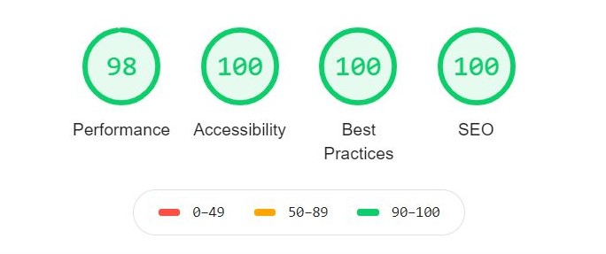

# Countries React App with color theme switcher\
:iphone: Website is fully responsive

Live URL: [https://stupefied-heisenberg-52de30.netlify.app/](https://stupefied-heisenberg-52de30.netlify.app/)

Storybook URL: [https://laughing-fermat-162337.netlify.app/](https://laughing-fermat-162337.netlify.app/)

## Technology stack
  - React (use: Higher-Order Component and Hooks)
  - Context API
  - Axios
  - Styled Components
  - React Router
  - Storybook
  - REST API ([https://restcountries.eu/](https://restcountries.eu/))

## Preview design
Design come from [Frontend Mentor](https://frontendmentor.io) website and it is a one of their challenges.

## Lighthouse report

