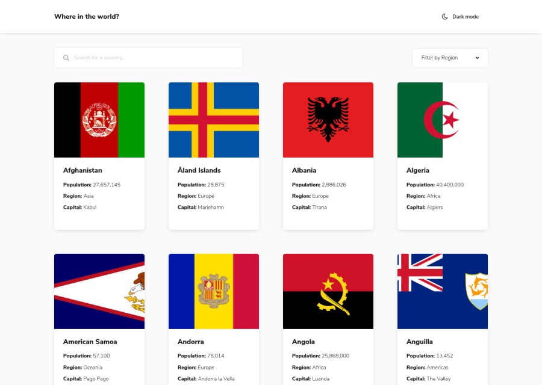

# Frontend Mentor - REST Countries API with color theme switcher solution

This is a solution to the [REST Countries API with color theme switcher challenge on Frontend Mentor](https://www.frontendmentor.io/challenges/rest-countries-api-with-color-theme-switcher-5cacc469fec04111f7b848ca). Frontend Mentor challenges help you improve your coding skills by building realistic projects. 

## Table of contents

- [Overview](#overview)
  - [The challenge](#the-challenge)
  - [Screenshot](#screenshot)
  - [Links](#links)
- [My process](#my-process)
  - [Built with](#built-with)
- [Author](#author)

## Overview

### The challenge

Users should be able to:

- See all countries from the API on the homepage
- Search for a country using an `input` field
- Filter countries by region
- Click on a country to see more detailed information on a separate page
- Click through to the border countries on the detail page
- Toggle the color scheme between light and dark mode

### Screenshot

### Links

- Live Site URL: [https://stupefied-heisenberg-52de30.netlify.app/](https://stupefied-heisenberg-52de30.netlify.app/)
- Storybook components library: [https://laughing-fermat-162337.netlify.app/](https://laughing-fermat-162337.netlify.app/)

## My process

### Built with

- [React](https://reactjs.org/) - JS library
- [Styled Components](https://styled-components.com/) - For styles
- [Storybook](https://storybook.js.org/) - Open source tool for building UI components and pages in isolation
- [Axios](https://axios-http.com/docs/intro) - A promise-based HTTP Client for node.js and the browser
- [React Router](https://reactrouter.com/) - Routing

## Author

- Frontend Mentor - [@przemg](https://www.frontendmentor.io/profile/przemg)
